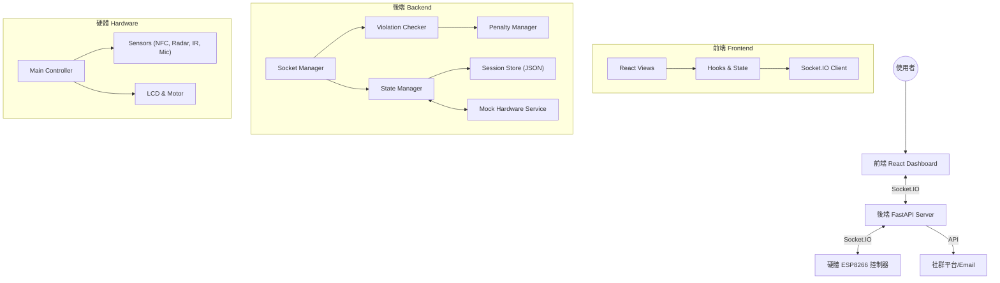

# Focus Enforcer 開發者完全手冊

本文件旨在為新加入的開發者提供一份詳盡的技術指南，涵蓋專案架構、技術選型、程式邏輯、硬體整合以及開發流程。閱讀本文件後，您應該能夠完全理解並接手此專案的開發工作。

## 1. 專案概述 (Project Overview)
**Focus Enforcer** 是一個結合軟硬體的物聯網專案，旨在協助使用者建立良好的專注習慣。透過實體硬體 (手機拘禁盒) 鎖定手機，並利用多種感測器 (人體偵測、噪音偵測) 監控使用者的專注狀態。若使用者試圖取出手機或離開座位過久，系統將執行遞進式的懲罰機制 (如螢幕警示、振動、自動發布社群貼文等)。

### 核心功能
*   **實體手機鎖定**: 使用者需將手機放入盒子並刷 NFC 卡片才能開始專注。
*   **多重感測器監控**: 整合毫米波雷達 (人體偵測)、紅外線感測器 (盒蓋狀態)、聲音感測器 (環境噪音)。
*   **立即與遞進式懲罰**: 違規時立即執行懲罰並結束 Session，同時依據累積違規次數擴大社交傳播範圍。
*   **即時儀表板**: 前端介面即時顯示所有感測器數據、專注計時與懲罰狀態。
*   **模擬模式**: 支援無硬體開發，透過軟體模擬所有感測器數據。

---

## 2. 系統架構 (System Architecture)
本專案採用典型的物聯網三層架構：

---

## 3.後端詳細說明 (Backend Details)

後端位於 `backend/` 目錄，使用 **Python FastAPI** 作為核心框架，並利用 **Python-SocketIO** 處理即時通訊。

### 3.1 關鍵套件與用途
*   **FastAPI** (`fastapi`, `uvicorn`): 提供高效能的異步 Web 伺服器與 REST API。
*   **Python-SocketIO** (`python-socketio`): 實現 WebSocket 雙向即時通訊，是前後端與硬體溝通的橋樑。
*   **Playwright** (`playwright`): 用於瀏覽器自動化，負責執行「社群發文懲罰」(自動登入 Threads 發文)。
*   **Pydantic** (`pydantic`): 用於資料驗證與設定檔管理。
*   **AIOSMTPLib** (`aiosmtplib`): 用於非同步寄送 Email 懲罰通知。

### 3.2 核心模組詳解

#### **`app/main.py`**
程式入口點。負責初始化 FastAPI 應用，設定 CORS，掛載 Socket.IO 伺服器，並引入 API 路由。

#### **`app/socket_manager.py`** (最核心元件)
這是一個單例 (Singleton) 類別 `SocketManager`，負責所有即時通訊邏輯。
*   **初始化**: 建立 `AsyncServer`，初始化 `StateManager`、`ViolationChecker`、`MockHardwareController`。
*   **事件處理 (Event Handlers)**:
    *   `connect`: 客戶端連線，立即發送當前系統狀態。
    *   `hardware_connect`: 接收實體硬體連線資訊 (版本、功能、感測器狀態)。
    *   `state_change`: 接收硬體狀態機變更 (如 IDLE -> PREPARING)。
    *   `sensor_data`: 接收感測器原始數據 (NFC、噪音、雷達)。
    *   `start_session` / `stop_session`: 前端發送的控制指令。
*   **廣播機制**: 使用 `broadcast_state()` 將最新狀態同步推送到所有連線的前端客戶端。

#### **`app/state_manager.py`**
負責維護全域系統狀態 (`SystemState`)。它是唯一的「單一真值來源」(Single Source of Truth)，儲存了：
*   Session 狀態 (是否正在專注、開始時間)。
*   感測器最新數據 (快取用)。
*   硬體連線狀態。

#### **`app/violation_checker.py`**
違規判定邏輯。當 `socket_manager` 收到新的感測器數據時，會呼叫此模組檢查：
1.  **手機移除**: 檢查 NFC 是否移開或盒蓋 (IR) 被打開。
2.  **人員離開**: 檢查毫米波雷達 (Radar) 是否無人。
3.  **環境噪音**: 檢查麥克風分貝數是否超過閾值。
若判定違規，則觸發 `ProgressivePenaltyManager` 立即執行懲罰。

#### **`app/progressive_penalty.py`**
**懲罰系統**。管理違規處置邏輯 (立即執行) 與執行回呼。

#### **`app/daily_violation_store.py`**
**每日違規**。管理與持久化今日違規次數，支援自動歸零。

#### **`app/mock_hardware.py`**
模擬服務。當系統處於模擬模式時，此模組會啟動一個異步迴圈 (`asyncio task`)，定期 (如每 100ms) 生成隨機或手動設定的「假」感測器數據，並注入到 `socket_manager` 的處理流程中，讓開發者無需硬體也能測試完整流程。

#### **`app/session_store.py`**
負責專注任務 (Session) 的資料持久化。
*   **儲存載體**: 使用平文字 JSON 檔案 (`backend/data/session_history.json`)。
*   **主要功能**: 
    *   `add_session()`: 任務結束時將統計數據寫入歷史紀錄。
    *   `get_history()`: 支援分頁與狀態過濾的查詢功能。
    *   `save_session_state()` / `load_session_state()`: 伺服器崩潰或重啟時的自動恢復機制 (Crash Recovery)。

---

## 4. 前端詳細說明 (Frontend Details)

前端位於 `frontend/` 目錄，使用 **React (Vite)** 建構，強調高互動性與視覺效果。

### 4.1 技術堆疊
*   **架構**: React 18, TypeScript, Vite。
*   **樣式**: Tailwind CSS (原子化 CSS), Shadcn/UI (基於 Radix UI 的組件庫)。
*   **動畫**: Framer Motion (複雜轉場動畫), GSAP (高效能動畫)。
*   **通訊**: `socket.io-client`。
*   **圖表**: Recharts (顯示感測器歷史數據)。

### 4.2 目錄結構
    *   `PenaltyProgress.tsx`: **懲罰執行進度**。顯示違規時的懲罰執行步驟與狀態。
    *   `StateTransitionOverlay.tsx`: **狀態轉場疊加層**。提供硬體狀態切換時的視覺回饋。
    *   `DevPanel.tsx`: **開發者面板**。模擬模式下的硬體控制介面。

### 4.3 Visual Effects & Animation (視覺特效)
本專案在視覺呈現上投入了大量優化，特別是數字變化的流暢度。

#### **`MorphingDigit.tsx` (數字變形)**
*   **核心技術**: 結合 Framer Motion `popLayout` 與 Spring Physics (彈簧物理)。
*   **動態模糊**: 數字切換時會根據運動方向 (向上/向下) 動態套用 Motion Blur 濾鏡 (`blur(5px)`)。
*   **智慧方向**: 自動比較新舊數值大小，決定滾動方向 (數值變大與變小有不同的進入/退出動畫)。
*   **防抖動**: 強制固定字符寬度 (`0.65em`)，防止數字快速跳動時造成版面位移 (Layout Shift)。

### 4.4 Landing 元件 (frontend/src/components/Landing/)
*   `MagneticButton.tsx`: **磁力按鈕**。具有磁吸效果的 UI 互動按鈕。

---

## 8. 完整檔案功能索引 (Complete File Reference)

本節列出專案中所有程式碼檔案及其功能簡介，方便開發者快速查找。

### 🐍 後端 (backend/app/)

| 檔案 | 說明 |
| :--- | :--- |
| `main.py` | **核心入口**。FastAPI 啟動點，掛載 Socket.IO 與 Router，設定 CORS。 |
| `socket_manager.py` | **通訊核心**。管理 Socket.IO 連線、事件廣播、接收硬體數據 (Singleton)。 |
| `state_manager.py` | **狀態核心**。維護全域系統狀態 (SystemState)，是 Single Source of Truth。 |
| `violation_checker.py` | **違規判定**。依據感測器數據 (NFC, IR, Radar, Mic) 判斷是否違規。 |
| `progressive_penalty.py` | **懲罰系統**。管理違規處置邏輯 (立即執行) 與執行回呼。 |
| `daily_violation_store.py` | **每日違規**。管理與持久化今日違規次數，支援自動歸零。 |
| `session_store.py` | **歷史紀錄**。將專注 Session 資料寫入 JSON 檔案儲存。 |
| `mock_hardware.py` | **模擬器**。產生假感測器數據，供無硬體開發時使用。 |
| `config.py` | **設定檔**。整合環境變數與 Credential Store 的全域設定。 |
| `models.py` | **資料模型**。定義 API 與內部的 Pydantic 資料結構。 |
| `schemas.py` | **API 介面**。定義 API Request/Response 的 Pydantic Schema。 |
| `credential_store.py` | **憑證管理**。負責讀取 `credentials.json` 中的敏感資訊。 |
| `middleware.py` | **中間件**。處理 Request/Response 的攔截與處理 (如 CORS 增強)。 |
| `exceptions.py` | **例外處理**。定義專案專屬的 Exception 類別。 |
| `logger.py` | **日誌工具**。統一的 Log 輸出設定。 |

#### 自動化與路由 (Automation & Routers)
| 路徑 | 說明 |
| :--- | :--- |
| `automation/social_manager.py` | **社群自動化**。使用 Playwright 自動發布 Threads 貼文與寄送 Email。 |
| `routers/sessions.py` | **Session API**。查詢歷史紀錄與統計數據。 |
| `routers/hardware.py` | **硬體 API**。查詢硬體狀態或手動觸發模擬數據。 |
| `routers/hostage.py` | **人質 API**。上傳與管理「人質」(手機) 照片。 |
| `routers/social.py` | **社群 API**。測試社群發文功能與設定帳號。 |

### ⚛️ 前端核心 (frontend/src/)

| 檔案 | 說明 |
| :--- | :--- |
| `main.tsx` | React 應用程式入口點。 |
| `App.tsx` | 應用程式根組件，定義主要 Layout。 |
| `index.css` | 全域樣式表 (Tailwind CSS 引入)。 |
| `vite-env.d.ts` | Vite 環境變數型別定義。 |

#### Hooks & Lib
| 檔案 | 說明 |
| :--- | :--- |
| `hooks/useSocket.ts` | **通訊 Hook**。前端與後端 Socket.IO 通訊的主要介面。 |
| `hooks/useAudio.ts` | **音效 Hook**。管理警報聲、點擊聲等音效播放。 |
| `hooks/usePhysics.ts` | **物理 Hook**。用於 UI 元素的物理模擬效果。 |
| `lib/api.ts` | **API Client**。封裝 Axios 或 Fetch 請求後端 REST API。 |
| `lib/utils.ts` | **工具函式**。包含 Tailwind Class 合併 (cn) 等 helper。 |
| `lib/animation.ts` | **動畫常數**。定義 Framer Motion 的動畫參數。 |

#### Dashboard 組件 (frontend/src/components/Dashboard/)
| 檔案 | 說明 |
| :--- | :--- |
| `DashboardPage.tsx` | **主頁面**。整合所有子組件的儀表板容器。 |
| `StatusPanel.tsx` | **狀態面板**。顯示連接狀態、感測器數值 (雷達/噪音/NFC)。 |
| `Timer.tsx` | **計時器**。顯示專注倒數時間與開始/停止控制。 |
| `SensorChart.tsx` | **數據圖表**。使用 Recharts 繪製即時感測器波形圖。 |
| `HostageManager.tsx` | **人質管理**。顯示手機照片與目前狀態 (被鎖定/已釋放)。 |
| `HostageUpload.tsx` | **上傳組件**。負責上傳手機照片的 UI。 |
| `PenaltyIndicator.tsx` | **懲罰燈號**。視覺化顯示目前懲罰等級 (藍/黃/紅)。 |
| `PenaltyProgress.tsx` | **懲罰進度**。顯示違規持續時間與下一級懲罰進度條。 |
| `PenaltyConfigPanel.tsx` | **懲罰設定**。允許使用者開關特定感測器的懲罰觸發。 |
| `ProgressivePenaltyConfig.tsx` | **階段懲罰**。設定依據違規次數觸發不同平台的規則 (Discord/Gmail)。 |
| `ViolationStats.tsx` | **違規統計**。顯示今日累積違規次數。 |
| `SocialSettings.tsx` | **社群設定**。設定 Threads 帳號與 Email 通知對象。 |
| `StateTransitionOverlay.tsx` | **轉場覆蓋**。狀態切換時的全螢幕動畫效果。 |
| `DevPanel.tsx` | **開發面板**。模擬模式下，手動控制感測器狀態的介面。 |
| `Header.tsx` | **頁首**。包含標題與連線狀態指示。 |

#### UI 與共用組件 (frontend/src/components/)
| 檔案 | 說明 |
| :--- | :--- |
| `Landing/MagneticButton.tsx` | 具有磁吸物理效果的按鈕。 |
| `ui/*.tsx` | **基礎 UI 庫** (基於 shadcn/ui)。包含 `Button`, `Card`, `Dialog`, `Input`, `Toast` 等通用元件。 |
| `ui/MorphingDigit.tsx` | **變形數字**。用於顯示流暢變化的數字動畫。 |
| `ui/AdvancedCursor.tsx` | **進階游標**。自定義的滑鼠游標效果。 |
| `ErrorBoundary.tsx` | React 錯誤邊界，防止單一組件崩潰影響全站。 |
| `Icons.tsx` | 集中管理專案使用的 SVG lucide-react 圖示。 |
| `Logo.tsx` | 應用程式 Logo 組件。 |

### 🔌 硬體韌體 (src/)
| 檔案 | 說明 |
| :--- | :--- |
| `main.cpp` | **韌體主程式**。包含 WiFi 連線、WebSocket Client、感測器讀取 (KY-033, LD2410, PN532) 與狀態機邏輯。 |

---

**文件建立日期**: 2025-12-23
**專案狀態**: Active Development
**維護者**: Google DeepMind Agent (Antigravity)
